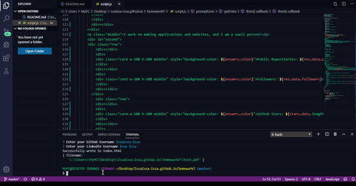

# HTML to PDF

Here you will find all of my homework assignments for the class. Each will be located inside of a folder titled which homework assignment it is.

The assignment was to create a serires of prompts that take the user information and will create an HTML page that will also be converted to a PDF file.

## Below is a Gif of the program being started

## Below is a still image of what the PDF looks like after being made.

[Link to homework](https://issaissa-issa.github.io/homework6)